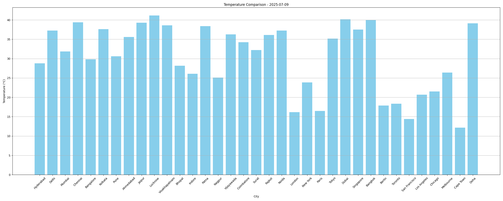

# Weather Dashboard - Python

This project fetches live weather data using OpenWeatherMap API, stores it in a CSV file, and visualizes the temperature comparison using matplotlib.

## Features
- Live API fetch for multiple cities
- Saves data to CSV
- Bar chart of temperatures
- Easy to run locally

## How to Run

1. Clone the repo
2. Add your OpenWeatherMap API key
3. Run `python weather_dashboard.py`

## Sample Output

